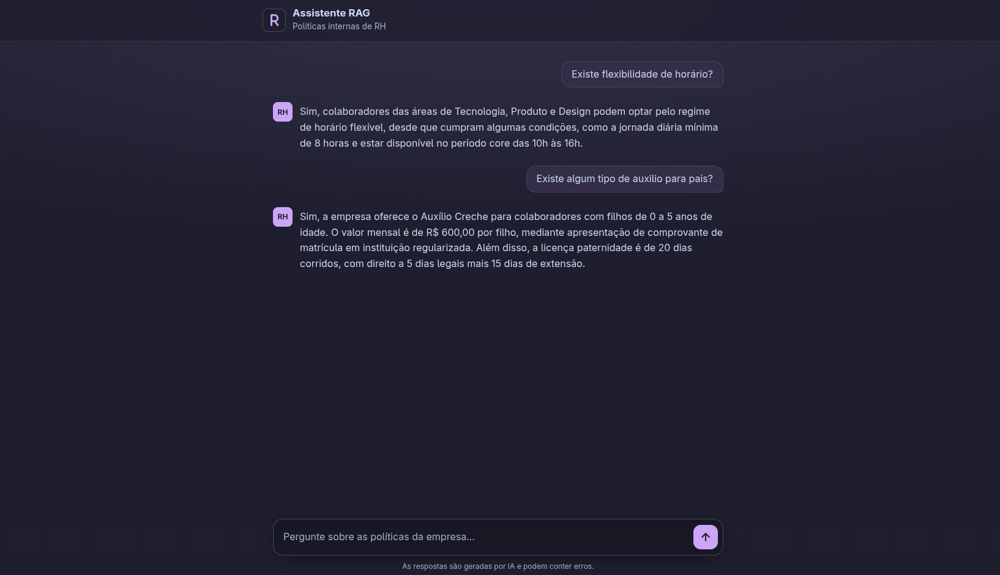

# My HNSW RAG

An HR internal-policy assistant built with Sinatra, LangChain, Hnswlib and OpenAI.

## Requirements

- Ruby 4.0.2 (pinned in `mise.toml`)
- An OpenAI API key

If you use [mise](https://mise.jdx.dev), install the pinned Ruby version with:

```bash
mise install
```

## Setup

From the project root:

```bash
# 1. Install the dependencies
bundle install

# 2. Configure your OpenAI API key
cp .env.example .env.local
```

Then edit `.env.local` and set your key:

```
OPENAI_API_KEY=sk-...
```

`.env.local` is ignored by git, so don't commit your key anywhere else.

Finally, put the knowledge base PDF at `data/document_sample.pdf`. The contents of `data/` are ignored by git, so the document stays on your machine. The app still starts without it, but questions fail until it's there. On the first question the app embeds the PDF and saves the index to `data/index.ann`. Later runs reuse that file, so delete it after changing the PDF.

## Running

From the project root:

```bash
bundle exec rackup
```

The app opens at http://localhost:9292. Use `-p <port>` to pick another port.

## Tests and lint

```bash
bundle exec rake          # specs + RuboCop
bundle exec rspec         # specs only
bundle exec rubocop       # lint only
```

## Project structure

```
.
├── config.ru                    # Rack entry point (used by rackup)
├── data/
│   ├── document_sample.pdf      # Knowledge base PDF (not committed, see Setup)
│   └── index.ann                # Hnswlib vector index, created on the first question (not committed)
├── lib/
│   ├── my_hnsw_rag.rb           # Loads the gems, .env.local and the app
│   └── my_hnsw_rag/
│       ├── assistant.rb         # PDF loading/splitting + vector store + retrieval + prompt + LLM call
│       ├── web.rb               # Sinatra routes (GET /, POST /ask)
│       ├── public/
│       │   ├── app.js           # Chat UI behavior
│       │   ├── styles.css       # Chat UI styles
│       │   └── favicon.svg      # "R" icon (.ico/.png variants are rendered from it)
│       └── views/index.erb      # Chat UI markup
├── spec/                        # RSpec suite
├── .github/screenshot.png       # Screenshot used in this README
├── .env.example                 # Environment variables template
├── mise.toml                    # Ruby version
└── Gemfile                      # Ruby dependencies
```

## Front end

The chat page is plain HTML, CSS and JavaScript: no framework, no bundler and no build step.

- **Markup:** a single ERB view (`views/index.erb`), rendered by Sinatra.
- **Styles:** `public/styles.css` uses the [Catppuccin](https://catppuccin.com) palette, Latte for light mode and Mocha for dark mode, switched automatically by `prefers-color-scheme`. Palette colors are CSS custom properties, mapped to semantic tokens (`--bg`, `--fg`, `--accent`, ...) and a 4px spacing scale. Text keeps a contrast ratio of at least 4.5:1 in both themes, and `prefers-reduced-motion` turns off transitions and animations, except the loading spinner.
- **Behavior:** `public/app.js` sends each question to `POST /ask` with `fetch` and renders the answer with `textContent`, so model output is never parsed as HTML. It's loaded with `defer`. New messages are announced to screen readers through an `aria-live` region.
- **Icons:** `favicon.svg` is the source icon; the `.ico` and Apple touch PNG are rendered from it.



---

Released in 2026.

By [Victor B. Fiamoncini](https://github.com/Victor-Fiamoncini) ☕️
